# PayMyBuddy


## **Prerequisites**
For the purpose of this project, a small VM (from [killer_code.com](https://killercoda.com/)) with k8s already installed was used. Recall that we are using **Kubernetes 1.19+**.

**1) Build the docker image**
To do so, follow the instructions mentioned in [build_docker.md](./build_docker.md).


**2) Create the namespace**
```
cd k8s/
kubectl apply -f namespace.yml
```
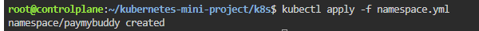

**3) Create a secret for your dockerhub account, so that our docker image can be pulled without error**
```
kubectl create secret docker-registry dockerhub-secret \
  --namespace=paymybuddy \
  --docker-server=https://index.docker.io/v1/ \
  --docker-username=YOUR_DOCKER_USERNAME \
  --docker-password=YOUR_PASSWORD \
  --docker-email=YOUR_EMAIL_ADRESS
```
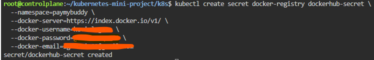

**4) Create the secrets for MySQL**
```
kubectl apply -f mysql-secrets.yml
```
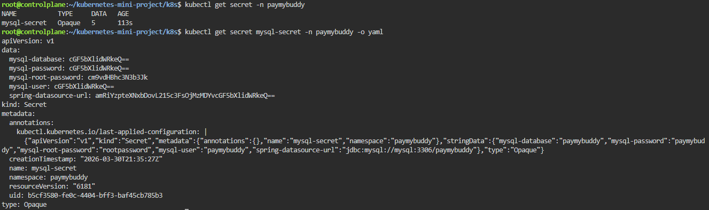

**5) Install MetalLB**
```
kubectl apply -f https://raw.githubusercontent.com/metallb/metallb/v0.13.12/config/manifests/metallb-native.yaml

# Wait for pods to be ready
kubectl wait -namespace metallb-system \
  --for=condition=ready pod \
  --selector=app=metallb \
  --timeout=120s
```
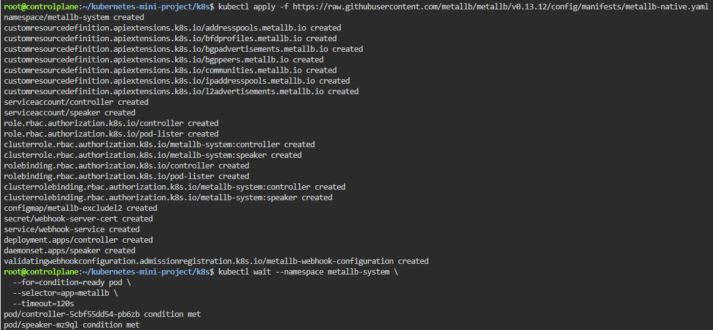

**6) Install the ingress controller**
```
kubectl apply -f https://raw.githubusercontent.com/kubernetes/ingress-nginx/controller-v1.9.4/deploy/static/provider/cloud/deploy.yaml

# Wait for the pod to be ready
kubectl wait --namespace ingress-nginx \
  --for=condition=ready pod \
  --selector=app.kubernetes.io/component=controller \
  --timeout=120s
```
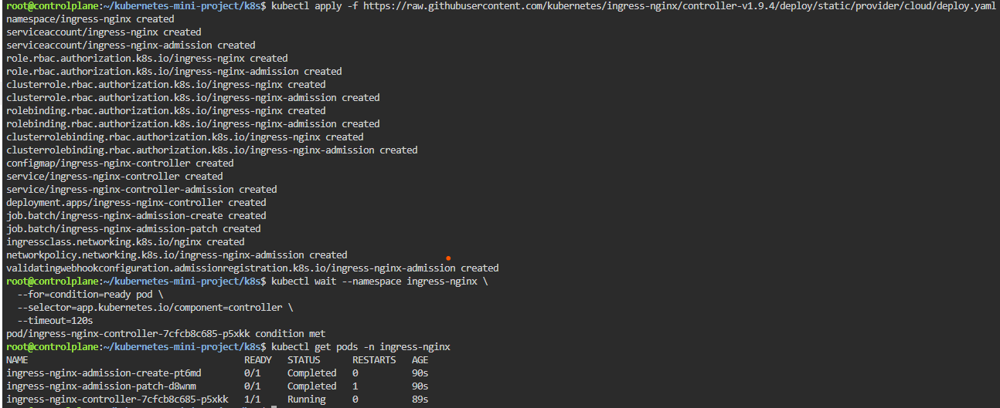

**7) Adapt IP range in the paymubddy-lb.yml file**
```
# Obtain the IP of the machine 
# For instance, if the IP is 10.0.29.5, then we shall use the following range: 10.0.29.200-10.0.29.250
hostname -I | awk '{print $1}'
```

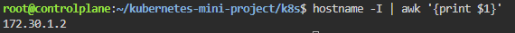

**NB:** Recall that the secrets can be created via the CLI:
```
kubectl create secret generic mysql-secret \
  --namespace=paymybuddy \
  --from-literal=mysql-root-password=rootpassword \
  --from-literal=mysql-database=paymybuddy \
  --from-literal=mysql-user=paymybuddy \
  --from-literal=mysql-password=paymybuddy \
  --from-literal=spring-datasource-url=jdbc:mysql://mysql:3306/paymybuddy
```

## **Create the resources**
```
# Create the other resources
kubectl apply -f .
```

## **Verification** 

```
# Get the secrets
kubectl get secret -n paymybuddy
```
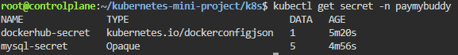

```
# Verify the content of a secret (base64 encoded)
kubectl get secret mysql-secret -n paymybuddy -o yaml
```

```
# Decode the value of a secret
kubectl get secret mysql-secret -n paymybuddy -o jsonpath='{.data.mysql-root-password}' | base64 --decode
```

```
# Get all the resources that were just created
kubectl get all -n paymybuddy
```
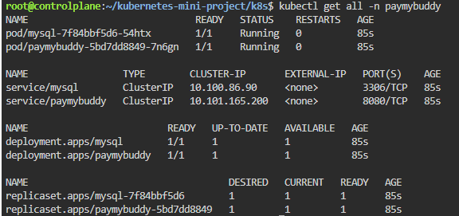


```
# Connect to a MySQL pod
kubectl exec -it -n paymybuddy deployment/mysql -- mysql -u paymybuddy -ppaymybuddy -e "SHOW DATABASES;"

# Verify the connexion to MySQL database
kubectl exec -it -n paymybuddy deployment/paymybuddy -- env | grep SPRING
```
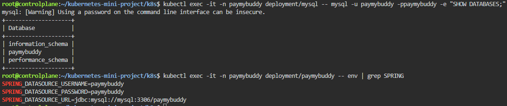


```
# Verify the logs of PayMyBuddy
kubectl logs -n paymybuddy -l app=paymybuddy
```

```
# Verification of the attribution of IP address
kubectl get svc -n ingress-nginx
```
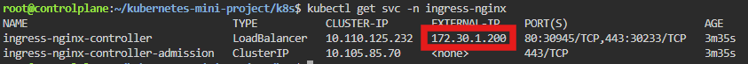

```
# Verify the Ingress
kubectl get ingress -n paymybuddy
```
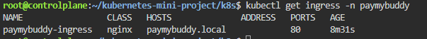

```
# Obtain the Ingress Controller's IP
INGRESS_IP=$(kubectl get svc -n ingress-nginx ingress-nginx-controller -o jsonpath='{.status.loadBalancer.ingress[0].ip}')
echo "Ingress IP: $INGRESS_IP"

# Add the new hostname to the /etc/hosts file
echo "$INGRESS_IP paymybuddy.local" | sudo tee -a /etc/hosts
```
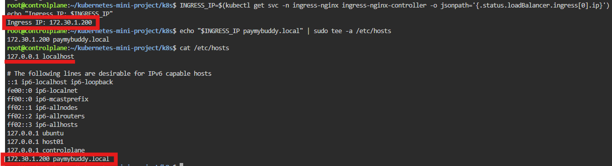

```
# Test the app
curl -v --connect-timeout 10 http://paymybuddy.local
```
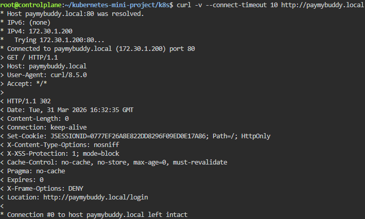
