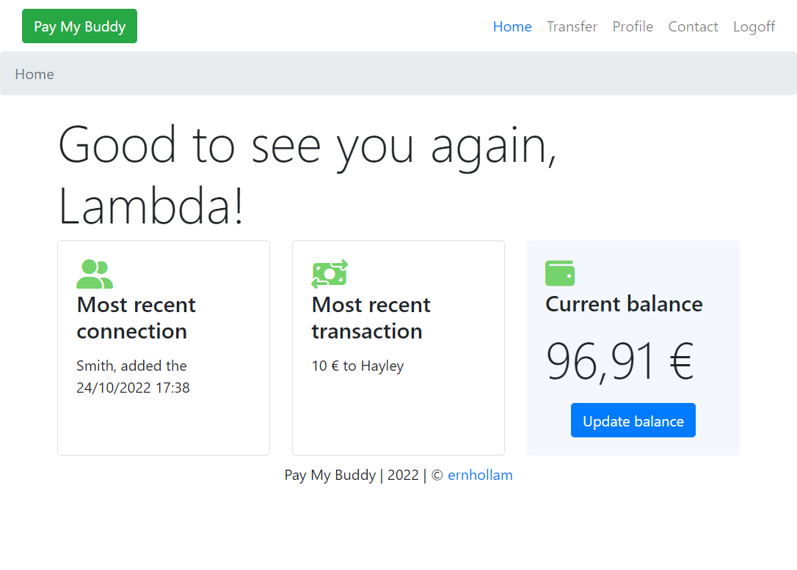

# PayMyBuddy

## Build the docker image
To do so, follow the instructions mentioned in [build_docker.md](./build_docker.md).

## Create the resources
```
kubectl apply -f k8s/
```

## Verification 

```
# Get the secrets
kubectl get secret -n paymybuddy

# Verify the content of the secret (base64 encoded)
kubectl get secret mysql-secret -n paymybuddy -o yaml

# Decode the value
kubectl get secret mysql-secret -n paymybuddy -o jsonpath='{.data.mysql-root-password}' | base64 --decode

# Get all the resources that were just created
kubectl get all -n paymybuddy

# Connect to a MySQL pod
kubectl exec -it -n paymybuddy deployment/mysql -- mysql -u paymybuddy -ppaymybuddy -e "SHOW DATABASES;"

# Verify the logs of PayMyBuddy
kubectl logs -n paymybuddy -l app=paymybuddy

# Verify the connexion to MySQL database
kubectl exec -it -n paymybuddy deployment/paymybuddy -- env | grep SPRING

# Verify the Ingress
kubectl get ingress -n paymybuddy

# Obtain the Ingress Controller's IP
INGRESS_IP=$(kubectl get svc -n ingress-nginx ingress-nginx-controller -o jsonpath='{.status.loadBalancer.ingress[0].ip}')
echo "Ingress IP: $INGRESS_IP"

# Add the new hostname to the **/etc/hosts** file
echo "$INGRESS_IP paymybuddy.local" | sudo tee -a /etc/hosts

# Test the app
curl http://paymybuddy.local
```

Recall that the secrets can be created via the CLI:
```
kubectl create secret generic mysql-secret \
  --namespace=paymybuddy \
  --from-literal=mysql-root-password=rootpassword \
  --from-literal=mysql-database=paymybuddy \
  --from-literal=mysql-user=paymybuddy \
  --from-literal=mysql-password=paymybuddy \
  --from-literal=spring-datasource-url=jdbc:mysql://mysql:3306/paymybuddy
```

