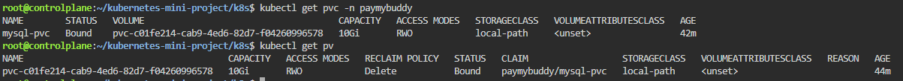
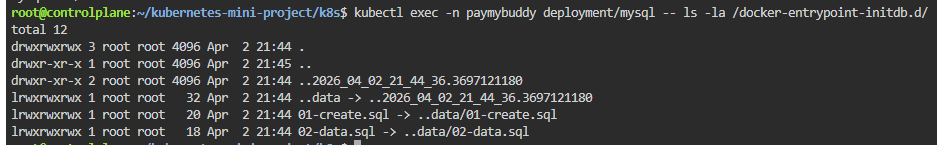
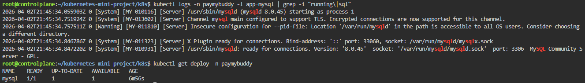
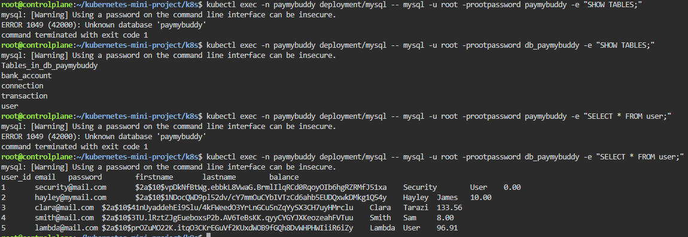
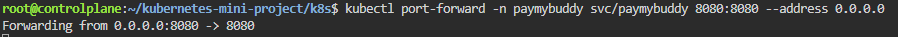
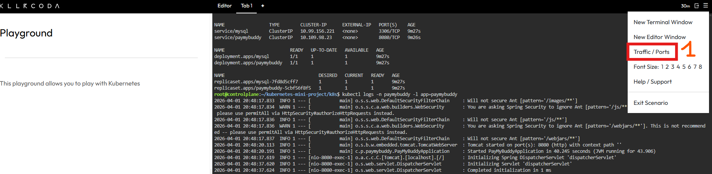
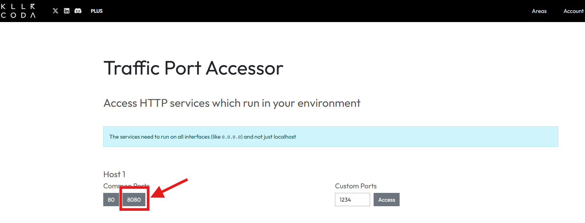
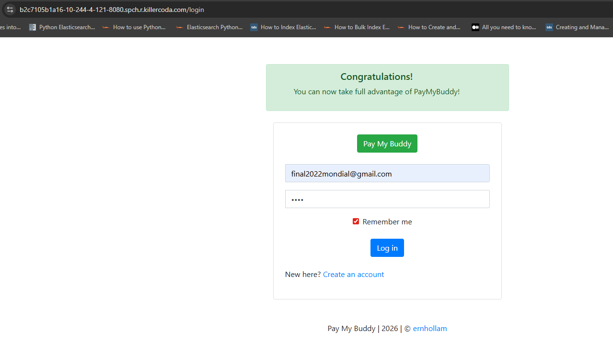
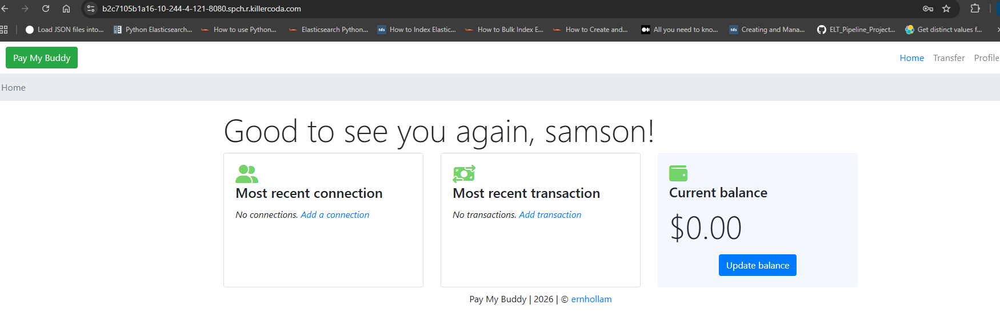
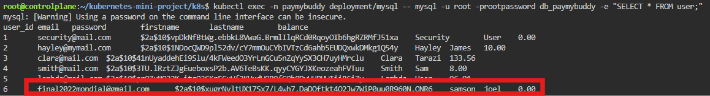

# 🚀 PayMyBuddy - Kubernetes Deployment

A complete guide to deploy the PayMyBuddy application on Kubernetes with MySQL database, MetalLB load balancer, and Nginx Ingress Controller.

---

## 📋 Table of Contents

- [Prerequisites](#-prerequisites)
- [Architecture](#-architecture)
- [Installation](#-installation)
  - [Step 1: Build Docker Image](#step-1-build-docker-image)
  - [Step 2: Create Namespace](#step-2-create-namespace)
  - [Step 3: Configure Secrets](#step-3-configure-secrets)
  - [Step 4: Install MetalLB](#step-4-install-metallb)
  - [Step 5: Install Ingress Controller](#step-5-install-ingress-controller)
  - [Step 6: Configure Persistent Storage](#step-6-configure-persistent-storage)
  - [Step 7: Deploy MySQL with Database Initialization](#step-7-deploy-mysql-with-database-initialization)
  - [Step 8: Deploy PayMyBuddy Application](#step-8-deploy-paymybuddy-application)
- [Verification](#-verification)
- [Accessing the Application on KillerCoda](#-accessing-the-application-on-killercoda)
- [Troubleshooting](#-troubleshooting)

---

## 🔧 Prerequisites

| Requirement | Version |
|-------------|---------|
| Kubernetes | 1.19+ |
| kubectl | Latest |
| Docker | Latest |
| Docker Hub Account | Required |

> 💡 **Tip:** For this project, a small VM from [KillerCoda](https://killercoda.com/) with Kubernetes pre-installed was used.

---

## 🏗️ Architecture
```
                    Internet / Browser
                           │
                           ▼
                ┌─────────────────────┐
                │      MetalLB        │
                │   Load Balancer     │
                └─────────────────────┘
                           │
                           ▼
                ┌─────────────────────┐
                │  Ingress Controller │
                │       (Nginx)       │
                └─────────────────────┘
                           │
                           ▼
                ┌─────────────────────┐
                │      Ingress        │
                │  paymybuddy.local   │
                └─────────────────────┘
                           │
                           ▼
        ┌──────────────────┴──────────────────┐
        │                                      │
        ▼                                      ▼
┌───────────────┐                    ┌───────────────┐
│  PayMyBuddy   │ ──────────────────▶│    MySQL      │
│   Service     │                    │   Service     │
│  (ClusterIP)  │                    │  (ClusterIP)  │
└───────────────┘                    └───────────────┘
        │                                      │
        ▼                                      ▼
┌───────────────┐                    ┌───────────────┐
│  PayMyBuddy   │                    │    MySQL      │
│     Pod       │                    │     Pod       │
│               │                    │  (with PVC)   │
│ - readiness   │                    │               │
│ - liveness    │                    │ - readiness   │
└───────────────┘                    │               │      
                                     └───────────────┘
                                             │
                                             ▼
                                     ┌───────────────┐
                                     │     PVC       │
                                     │  mysql-pvc    │
                                     └───────────────┘
                                             │
                                             ▼
                                     ┌───────────────┐
                                     │      PV       │
                                     │  (Dynamic)    │
                                     └───────────────┘
```

---

## 🚀 Installation

### Step 1: Build Docker Image

Follow the instructions in [build_docker.md](./build_docker.md) to build and push the Docker image to your private registry.

---

### Step 2: Create Namespace
```bash
cd k8s/
kubectl apply -f namespace.yml
```


✅ **Expected result:** Namespace `paymybuddy` created successfully.

---

### Step 3: Configure Secrets

#### 🔐 Docker Hub Secret

Create a secret to pull images from your private Docker Hub repository:
```bash
kubectl create secret docker-registry dockerhub-secret \
  --namespace=paymybuddy \
  --docker-server=https://index.docker.io/v1/ \
  --docker-username=YOUR_DOCKER_USERNAME \
  --docker-password=YOUR_PASSWORD \
  --docker-email=YOUR_EMAIL_ADDRESS
```


#### 🔐 MySQL Secrets
```bash
kubectl apply -f mysql-secrets.yml
```


> 💡 **Alternative:** You can also create MySQL secrets via CLI:
> ```bash
> kubectl create secret generic mysql-secret \
>   --namespace=paymybuddy \
>   --from-literal=mysql-root-password=rootpassword \
>   --from-literal=mysql-database=db_paymybuddy \
>   --from-literal=mysql-user=paymybuddy \
>   --from-literal=mysql-password=paymybuddy \
>   --from-literal=spring-datasource-url=jdbc:mysql://mysql:3306/db_paymybuddy
> ```

---

### Step 4: Install MetalLB

MetalLB provides external IP addresses for LoadBalancer services in bare-metal environments.
```bash
# Install MetalLB
kubectl apply -f https://raw.githubusercontent.com/metallb/metallb/v0.13.12/config/manifests/metallb-native.yaml

# Wait for pods to be ready
kubectl wait --namespace metallb-system \
  --for=condition=ready pod \
  --selector=app=metallb \
  --timeout=120s
```


#### 📍 Configure IP Range

Find your machine's IP address to configure the IP pool:
```bash
hostname -I | awk '{print $1}'
```


> ⚠️ **Important:** Update the IP range in `paymybuddy-lb.yml` based on your network.
> 
> Example: If your IP is `10.0.29.5`, use range `10.0.29.200-10.0.29.250`

---

### Step 5: Install Ingress Controller

The Nginx Ingress Controller manages external access to services via HTTP/HTTPS routing.
```bash
# Install Nginx Ingress Controller
kubectl apply -f https://raw.githubusercontent.com/kubernetes/ingress-nginx/controller-v1.9.4/deploy/static/provider/cloud/deploy.yaml

# Wait for the pod to be ready
kubectl wait --namespace ingress-nginx \
  --for=condition=ready pod \
  --selector=app.kubernetes.io/component=controller \
  --timeout=120s
```


---

### Step 6: Configure Persistent Storage

#### 📦 Install Local Path Provisioner

For dynamic PV provisioning on bare-metal or KillerCoda environments:
```bash
kubectl apply -f https://raw.githubusercontent.com/rancher/local-path-provisioner/v0.0.26/deploy/local-path-storage.yaml

# Verify StorageClass
kubectl get storageclass
```

#### 📦 Create PersistentVolumeClaim for MySQL
```bash
kubectl apply -f mysql-pvc.yml
```

Verify the PVC is created:
```bash
kubectl get pvc -n paymybuddy
```



---

### Step 7: Deploy MySQL with Database Initialization

```bash
# Apply the configMap
kubectl apply -f mysql-initdb-configmap.yml
# Deploy MySQL database
kubectl apply -f mysql-deployment.yml
kubectl apply -f mysql-service.yml
```


#### 🩺 MySQL Health Probes

| Probe | Type | Command | Initial Delay | Period |
|-------|------|---------|---------------|--------|
| readinessProbe | exec | `mysqladmin ping` | 30s | 10s |

---

### Step 8: Deploy PayMyBuddy Application
```bash
kubectl apply -f paymybuddy-deployment.yml
kubectl apply -f paymybuddy-service.yml
kubectl apply -f paymybuddy-ingress.yml
kubectl apply -f paymybuddy-lb.yml
```

#### 🩺 PayMyBuddy Health Probes

| Probe | Type | Path | Initial Delay | Period |
|-------|------|------|---------------|--------|
| readinessProbe | httpGet | /login | 60s | 10s |
| livenessProbe | httpGet | /login | 90s | 30s |

---

## ✅ Verification

### 🔍 Check Secrets
```bash
# List all secrets
kubectl get secret -n paymybuddy
```


```bash
# View secret content (base64 encoded)
kubectl get secret mysql-secret -n paymybuddy -o yaml

# Decode a secret value
kubectl get secret mysql-secret -n paymybuddy -o jsonpath='{.data.mysql-root-password}' | base64 --decode
```

---

### 🔍 Check Persistent Storage
```bash
# Check PVC status
kubectl get pvc -n paymybuddy

# Check PV status
kubectl get pv

# Describe PVC for details
kubectl describe pvc mysql-pvc -n paymybuddy
```

---

### 🔍 Check Resources
```bash
# List all resources in the namespace
kubectl get all -n paymybuddy
```


---

### 🔍 Check Database Initialization and Connection
```bash
# Verify the SQL files are well mounted
kubectl exec -n paymybuddy deployment/mysql -- ls -la /docker-entrypoint-initdb.d/
# Verify MYSQL logs
kubectl logs -n paymybuddy -l app=mysql | grep -i "running\|sql"
# Verify tables' creation
kubectl exec -n paymybuddy deployment/mysql -- mysql -u root -prootpassword db_paymybuddy -e "SHOW TABLES;"
# Verify the data
kubectl exec -n paymybuddy deployment/mysql -- mysql -u root -prootpassword paymybuddy -e "SELECT * FROM user;"
```






---

### 🔍 Check Health Probes Status
```bash
# Check pod conditions (Ready status depends on probes)
kubectl get pods -n paymybuddy -o wide

# Describe pod to see probe status
kubectl describe pod -n paymybuddy -l app=mysql | grep -A 10 "Conditions"
kubectl describe pod -n paymybuddy -l app=paymybuddy | grep -A 10 "Conditions"
```

---

### 🔍 Check Application Logs
```bash
kubectl logs -n paymybuddy -l app=paymybuddy
```

---

### 🔍 Check Ingress Configuration
```bash
# Verify IP attribution
kubectl get svc -n ingress-nginx
```


```bash
# Verify Ingress
kubectl get ingress -n paymybuddy
```


---

### 🌐 Test Application via CLI
```bash
# Get Ingress Controller IP
INGRESS_IP=$(kubectl get svc -n ingress-nginx ingress-nginx-controller -o jsonpath='{.status.loadBalancer.ingress[0].ip}')
echo "Ingress IP: $INGRESS_IP"

# Add hostname to /etc/hosts
echo "$INGRESS_IP paymybuddy.local" | sudo tee -a /etc/hosts
```


```bash
# Test the application
curl -v --connect-timeout 10 http://paymybuddy.local
```


✅ **Expected result:** HTTP 302 redirect to `/login` page.

---

## 🖥️ Accessing the Application on KillerCoda

Since KillerCoda runs on a remote VM, you cannot modify your local `/etc/hosts` file. Use one of these methods instead:

### Method 1: Port Forward (Recommended)
```bash
# Forward port 8080 to the PayMyBuddy service
kubectl port-forward -n paymybuddy svc/paymybuddy 8080:8080 --address 0.0.0.0 &
```

Then access the application:

1. Click on the **"Traffic / Ports"** icon in KillerCoda
2. Enter port **8080**
3. Click **"Access"** to open the application in a new tab











If we recall, the user with the email **final2022mondial@gmail.com** was not present in the database (cfrs the section **Check Database Initialization and Connection**). Now, we want to check if our new user has been added or not to the **user** table.

```bash
kubectl exec -n paymybuddy deployment/mysql -- mysql -u root -prootpassword db_paymybuddy -e "SELECT * FROM user;"
```



---

### Method 2: NodePort
```bash
# Change service type to NodePort
kubectl patch svc paymybuddy -n paymybuddy -p '{"spec": {"type": "NodePort"}}'

# Get the NodePort
NODE_PORT=$(kubectl get svc paymybuddy -n paymybuddy -o jsonpath='{.spec.ports[0].nodePort}')
echo "NodePort: $NODE_PORT"
```

Then access via KillerCoda:

1. Click on **"Traffic / Ports"**
2. Enter the **NodePort** displayed (e.g., 32xxx)
3. Click **"Access"**

---

### 📊 KillerCoda Access Methods Summary

| Method | Command | Port to Access |
|--------|---------|----------------|
| Port Forward | `kubectl port-forward -n paymybuddy svc/paymybuddy 8080:8080 --address 0.0.0.0 &` | 8080 |
| NodePort | `kubectl patch svc paymybuddy -n paymybuddy -p '{"spec": {"type": "NodePort"}}'` | NodePort (32xxx) |

---

## 🛠️ Troubleshooting

| Issue | Solution |
|-------|----------|
| `ImagePullBackOff` | Check Docker Hub credentials and secret |
| `EXTERNAL-IP` pending | Verify MetalLB configuration and IP range |
| Ingress class `NONE` | Add `ingressClassName: nginx` to Ingress manifest |
| 404 Not Found | Verify Ingress rules and service endpoints |
| Connection timeout | Check pod status and application logs |
| PVC `Pending` | Verify StorageClass exists and is default |
| MySQL tables not created | Check init-mysql logs for errors |
| `Access denied` in init-mysql | Wait longer for MySQL root user initialization |
| readinessProbe failing | Increase `initialDelaySeconds` |

### Useful Commands
```bash
# Check pod status
kubectl get pods -n paymybuddy

# View pod logs
kubectl logs -n paymybuddy -l app=paymybuddy

# Describe pod for events
kubectl describe pod -n paymybuddy -l app=paymybuddy

# Check endpoints
kubectl get endpoints -n paymybuddy

# Check PVC and PV
kubectl get pvc -n paymybuddy
kubectl get pv

# Check StorageClass
kubectl get storageclass

# Force restart a deployment
kubectl rollout restart deployment/mysql -n paymybuddy
kubectl rollout restart deployment/paymybuddy -n paymybuddy
```

---

## 📁 Project Structure
```
k8s/
├── namespace.yml                 # Namespace definition
├── mysql-secrets.yml             # MySQL credentials
├── mysql-initdb-configmap.yml    # For configMap
├── mysql-pvc.yml                 # PersistentVolumeClaim for MySQL
├── mysql-deployment.yml          # MySQL deployment with InitContainers
├── mysql-service.yml             # MySQL ClusterIP service
├── paymybuddy-deployment.yml     # PayMyBuddy deployment with probes
├── paymybuddy-service.yml        # PayMyBuddy ClusterIP service
├── paymybuddy-ingress.yml        # Ingress rules
├── paymybuddy-lb.yml             # MetalLB IP pool configuration
```

---

## 📚 Resources

- [Kubernetes Documentation](https://kubernetes.io/docs/)
- [MetalLB Documentation](https://metallb.universe.tf/)
- [Nginx Ingress Controller](https://kubernetes.github.io/ingress-nginx/)
- [Local Path Provisioner](https://github.com/rancher/local-path-provisioner)
- [KillerCoda Platform](https://killercoda.com/)

---

## 👨‍💻 Author

**Kevin Lagaza**

---

## 📄 License

This project is licensed under the MIT License.